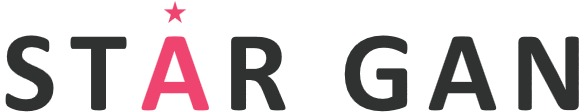
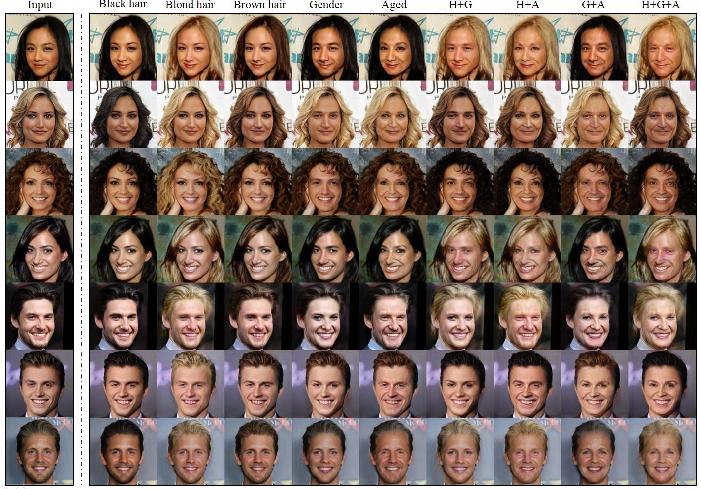
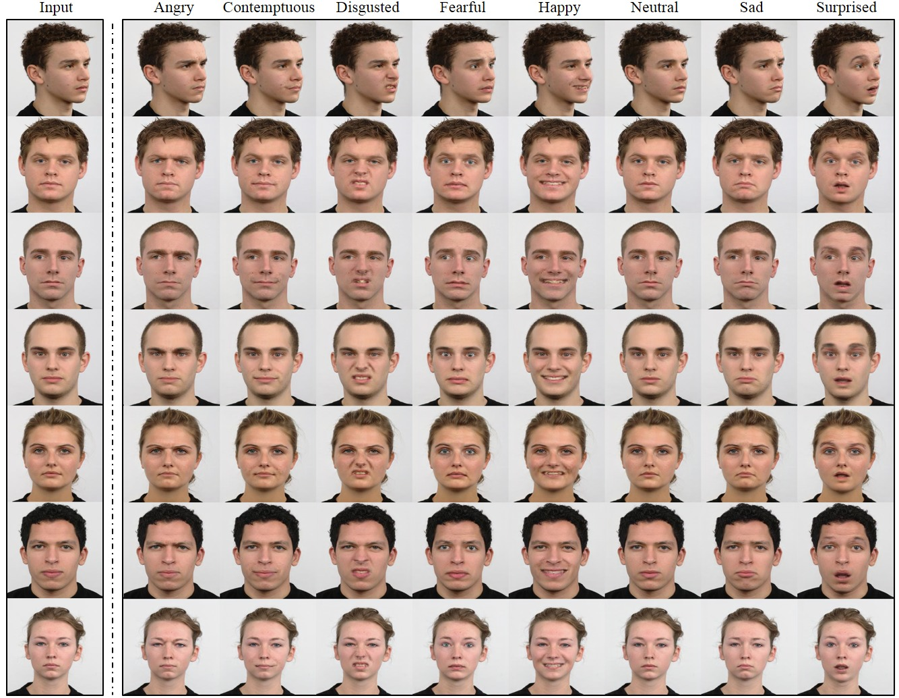
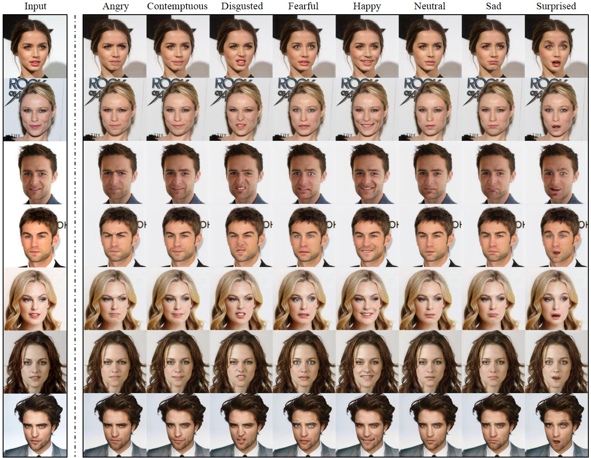

<p align="center"></p>

--------------------------------------------------------------------------------
This repository provides a PyTorch implementation of [StarGAN](https://arxiv.org/abs/1711.09020). StarGAN can flexibly translate an input image to any desired target domain using only a single generator and a discriminator. The demo video for StarGAN can be found [here](https://www.youtube.com/watch?v=EYjdLppmERE).

<p align="center"></p>

<br/>

## Paper
[StarGAN: Unified Generative Adversarial Networks for Multi-Domain Image-to-Image Translation](https://arxiv.org/abs/1711.09020) <br/>
[Yunjey Choi](https://github.com/yunjey)<sup> 1,2</sup>, [Minje Choi](https://github.com/mjc92)<sup> 1,2</sup>, [Munyoung Kim](https://www.facebook.com/munyoung.kim.1291)<sup> 2,3</sup>, [Jung-Woo Ha](https://www.facebook.com/jungwoo.ha.921)<sup> 2</sup>, [Sung Kim](https://www.cse.ust.hk/~hunkim/)<sup> 2,4</sup>, and [Jaegul Choo](https://sites.google.com/site/jaegulchoo/)<sup> 1,2</sup>    <br/>
<sup>1 </sup>Korea University, <sup>2 </sup>Clova AI Research (NAVER Corp.), <sup>3 </sup>The College of New Jersey, <sup> 4 </sup>HKUST  <br/>
IEEE Conference on Computer Vision and Pattern Recognition ([CVPR](http://cvpr2018.thecvf.com/)), 2018 (<b>Oral</b>) 

<br/>

## Dependencies
* [Python 3.5+](https://www.continuum.io/downloads)
* [PyTorch 0.4.0+](http://pytorch.org/)
* [TensorFlow 1.3+](https://www.tensorflow.org/) (optional for tensorboard)


<br/>

## Usage

### 1. Cloning the repository
```bash
$ git clone https://github.com/yunjey/StarGAN.git
$ cd StarGAN/
```

### 2. Downloading the dataset
To download the CelebA dataset:
```bash
$ bash download.sh celeba
```

To download the RaFD dataset, you must request access to the dataset from [the Radboud Faces Database website](http://www.socsci.ru.nl:8180/RaFD2/RaFD?p=main). Then, you need to create a folder structure as described [here](https://github.com/yunjey/StarGAN/blob/master/jpg/RaFD.md).

### 3. Training
To train StarGAN on CelebA, run the training script below. See [here](https://github.com/yunjey/StarGAN/blob/master/jpg/CelebA.md) for a list of selectable attributes in the CelebA dataset. If you change the `selected_attrs` argument, you should also change the `c_dim` argument accordingly.

```bash
$ python main.py --mode train --dataset CelebA --image_size 128 --c_dim 5 \
                 --sample_dir stargan_celeba/samples --log_dir stargan_celeba/logs \
                 --model_save_dir stargan_celeba/models --result_dir stargan_celeba/results \
                 --selected_attrs Black_Hair Blond_Hair Brown_Hair Male Young
```

To train StarGAN on RaFD:

```bash
$ python main.py --mode train --dataset RaFD --image_size 128 --c_dim 8 \
                 --sample_dir stargan_rafd/samples --log_dir stargan_rafd/logs \
                 --model_save_dir stargan_rafd/models --result_dir stargan_rafd/results
```

To train StarGAN on both CelebA and RafD:

```bash
$ python main.py --mode=train --dataset Both --image_size 256 --c_dim 5 --c2_dim 8 \
                 --sample_dir stargan_both/samples --log_dir stargan_both/logs \
                 --model_save_dir stargan_both/models --result_dir stargan_both/results
```

To train StarGAN on your own dataset, create a folder structure in the same format as [RaFD](https://github.com/yunjey/StarGAN/blob/master/jpg/RaFD.md) and run the command:

```bash
$ python main.py --mode train --dataset RaFD --rafd_crop_size CROP_SIZE --image_size IMG_SIZE \
                 --c_dim LABEL_DIM --rafd_image_dir TRAIN_IMG_DIR \
                 --sample_dir stargan_custom/samples --log_dir stargan_custom/logs \
                 --model_save_dir stargan_custom/models --result_dir stargan_custom/results
```


### 4. Testing

To test StarGAN on CelebA:

```bash
$ python main.py --mode test --dataset CelebA --image_size 128 --c_dim 5 \
                 --sample_dir stargan_celeba/samples --log_dir stargan_celeba/logs \
                 --model_save_dir stargan_celeba/models --result_dir stargan_celeba/results \
                 --selected_attrs Black_Hair Blond_Hair Brown_Hair Male Young
```

To test StarGAN on RaFD:

```bash
$ python main.py --mode test --dataset RaFD --image_size 128 \
                 --c_dim 8 --rafd_image_dir data/RaFD/test \
                 --sample_dir stargan_rafd/samples --log_dir stargan_rafd/logs \
                 --model_save_dir stargan_rafd/models --result_dir stargan_rafd/results
```

To test StarGAN on both CelebA and RaFD:

```bash
$ python main.py --mode test --dataset Both --image_size 256 --c_dim 5 --c2_dim 8 \
                 --sample_dir stargan_both/samples --log_dir stargan_both/logs \
                 --model_save_dir stargan_both/models --result_dir stargan_both/results
```

To test StarGAN on your own dataset:

```bash
$ python main.py --mode test --dataset RaFD --rafd_crop_size CROP_SIZE --image_size IMG_SIZE \
                 --c_dim LABEL_DIM --rafd_image_dir TEST_IMG_DIR \
                 --sample_dir stargan_custom/samples --log_dir stargan_custom/logs \
                 --model_save_dir stargan_custom/models --result_dir stargan_custom/results
```
### 5. Pretrained model
To download a pretrained model checkpoint, run the script below. The pretrained model checkpoint will be downloaded and saved into `./stargan_celeba_256/models` directory.

```bash
$ bash download.sh pretrained-celeba-256x256
```

To translate images using the pretrained model, run the evaluation script below. The translated images will be saved into `./stargan_celeba_256/results` directory.

```bash
$ python main.py --mode test --dataset CelebA --image_size 256 --c_dim 5 \
                 --selected_attrs Black_Hair Blond_Hair Brown_Hair Male Young \
                 --model_save_dir='stargan_celeba_256/models' \
                 --result_dir='stargan_celeba_256/results'
```

<br/>

## Results

### 1. Facial Attribute Transfer on CelebA
<p align="center"></p>

### 2. Facial Expression Synthesis on RaFD
<p align="center"></p>

### 3. Facial Expression Synthesis on CelebA
<p align="center"></p>


<br/>

## Citation
If this work is useful for your research, please cite our [paper](https://arxiv.org/abs/1711.09020):
```
@InProceedings{StarGAN2018,
author = {Choi, Yunjey and Choi, Minje and Kim, Munyoung and Ha, Jung-Woo and Kim, Sunghun and Choo, Jaegul},
title = {StarGAN: Unified Generative Adversarial Networks for Multi-Domain Image-to-Image Translation},
booktitle = {The IEEE Conference on Computer Vision and Pattern Recognition (CVPR)},
month = {June},
year = {2018}
}
```

<br/>

## Acknowledgement
This work was mainly done while the first author did a research internship at [Clova AI Research, NAVER](https://clova.ai/en/research/research-area-detail.html?id=0). We thank all the researchers at NAVER, especially Donghyun Kwak, for insightful discussions.
