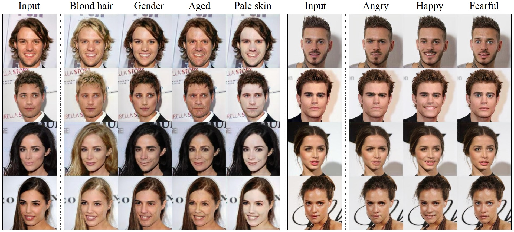
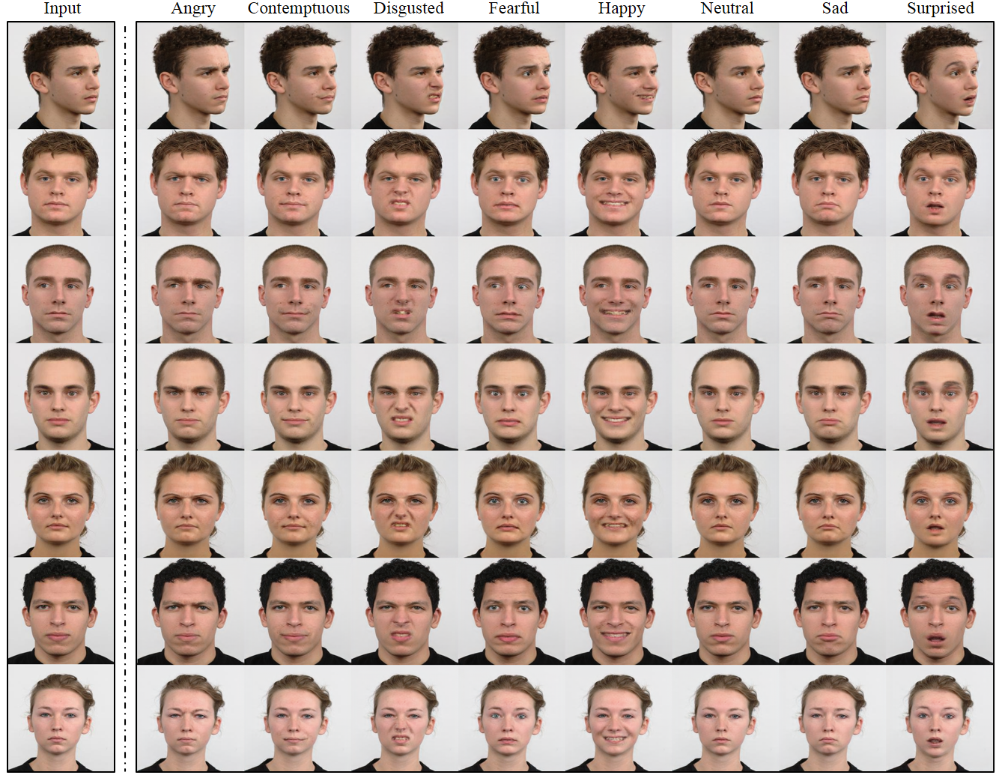
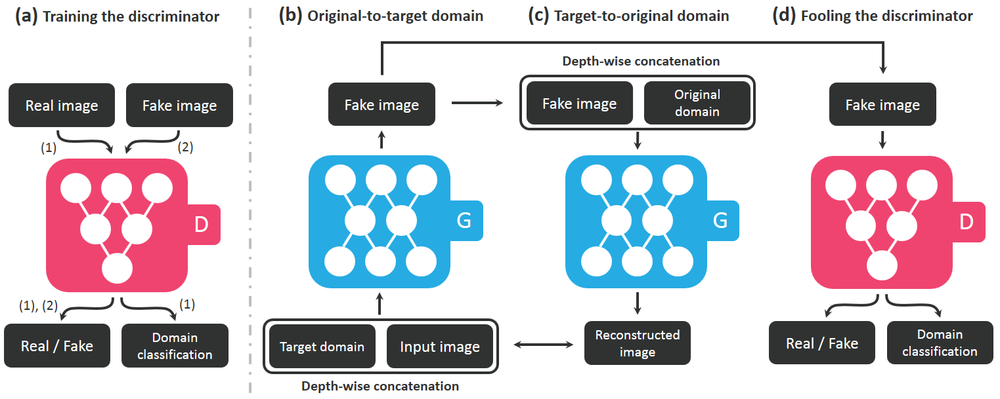
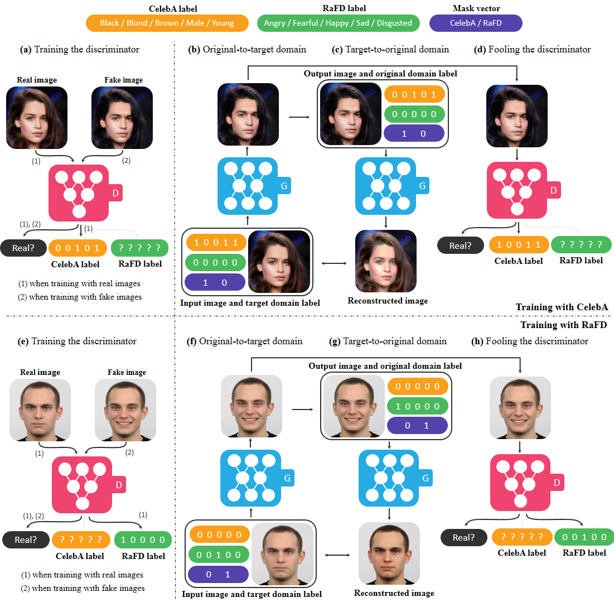

<p align="center"></p>

--------------------------------------------------------------------------------
PyTorch implementation of [StarGAN: Unified Generative Adversarial Networks for Multi-Domain Image-to-Image Translation](https://arxiv.org/abs/1711.09020). StarGAN can flexibly translate an input image to any desired target domain using only a single generator and a discriminator. The demo video for StarGAN can be found [here](https://www.youtube.com/watch?v=EYjdLppmERE).

<p align="center"></p>

## Authors

[Yunjey Choi](https://github.com/yunjey), [Minje Choi](https://github.com/mjc92), [Munyoung Kim](https://www.facebook.com/munyoung.kim.1291), [Jung-Woo Ha](https://www.facebook.com/jungwoo.ha.921), [Sung Kim](https://www.cse.ust.hk/~hunkim/), and [Jaegul Choo](https://sites.google.com/site/jaegulchoo/)    
Korea Universitiy, Clova AI Research (NAVER), The College of New Jersey, HKUST  
&nbsp;


## Results

#### Facial Attribute Transfer on CelebA
The images are generated by StarGAN trained on the CelebA dataset.
<p align="center"></p>

#### Facial Expression Synthesis on RaFD
The images are generated by StarGAN trained on the RaFD dataset.
<p align="center"></p>

#### Facial Expression Synthesis on CelebA
The images are generated by StarGAN trained on both the CelebA and RaFD dataset.
<p align="center"></p>


&nbsp;

## Model Description
### Training within a Single Dataset
Overview of StarGAN, consisting of two modules, a discriminator <b>D</b> and a generator <b>G</b>. <b>(a)</b> <b>D</b> learns to distinguish between real and fake images and classify the real images to its corresponding domain. <b>(b)</b> <b>G</b> takes in as input both the image and target domain label and generates an fake image. The target domain label is spatially replicated and concatenated with the input image. <b>(c)</b> <b>G</b> tries to reconstruct the original image from the fake image given the original domain label. <b>(d)</b> <b>G</b> tries to generate images indistinguishable from real images and classifiable as target domain by <b>D</b>.
<p align="center"></p>

### Training with Multiple Datasets
Overview of StarGAN when training with both CelebA and RaFD. <b>(a) ~ (d)</b> shows the training process using CelebA, and <b>(e) ~ (h)</b> shows the training process using RaFD. <b>(a), (e)</b> The discriminator <b>D</b> learns to distinguish between real and fake images and minimize the classification error only for the known label. <b>(b), (c), (f), (g)</b> When the mask vector (purple) is [1, 0], the generator <b>G</b> learns to focus on the CelebA label (yellow) and ignore the RaFD label (green) to perform image-to-image translation, and vice versa when the mask vector is [0, 1]. <b>(d), (h)</b> <b>G</b> tries to generate images that are both indistinguishable from real images and classifiable by <b>D</b> as belonging to the target domain.
<p align="center"></p>

&nbsp;

## Prerequisites
* [Python 3.5+](https://www.continuum.io/downloads)
* [PyTorch 0.2.0](http://pytorch.org/)
* [TensorFlow 1.3+](https://www.tensorflow.org/) (optional for tensorboard)

&nbsp;

## Getting Started

#### 1. Clone the repository
```bash
$ git clone https://github.com/yunjey/StarGAN.git
$ cd StarGAN/
```

#### 2. Download the dataset
##### (i) CelebA dataset
```bash
$ bash download.sh
```

##### (ii) RaFD dataset
Because <b>RaFD</b> is not a public dataset, you must first request access to the dataset from [the Radboud Faces Database website](http://www.socsci.ru.nl:8180/RaFD2/RaFD?p=main). Then, you need to create the folder structure as decribed [here.](https://github.com/yunjey/StarGAN/blob/master/png/RaFD.md)

#### 3. Train StarGAN
##### (i) Training with CelebA

```bash
$ python main.py --mode='train' --dataset='CelebA' --c_dim=5 --image_size=128 \
                 --sample_path='stargan_celebA/samples' --log_path='stargan_celebA/logs' \
                 --model_save_path='stargan_celebA/models' --result_path='stargan_celebA/results'
```
##### (ii) Training with RaFD

```bash
$ python main.py --mode='train' --dataset='RaFD' --c_dim=8 --image_size=128 \
                 --num_epochs=200 --num_epochs_decay=100 --sample_step=200 --model_save_step=200 \
                 --sample_path='stargan_rafd/samples' --log_path='stargan_rafd/logs' \
                 --model_save_path='stargan_rafd/models' --result_path='stargan_rafd/results'
```

##### (iii) Training with CelebA+RaFD

```bash
$ python main.py --mode='train' --dataset='Both' --image_size=256 --num_iters=200000 --num_iters_decay=100000 \
                 --sample_path='stargan_both/samples' --log_path='stargan_both/logs' \
                 --model_save_path='stargan_both/models' --result_path='stargan_both/results'
```

#### 4. Test StarGAN
##### (i) Facial attribute transfer on CelebA
```bash
$ python main.py --mode='test' --dataset='CelebA' --c_dim=5 --image_size=128 --test_model='20_1000' \
                 --sample_path='stargan_celebA/samples' --log_path='stargan_celebA/logs' \
                 --model_save_path='stargan_celebA/models' --result_path='stargan_celebA/results'
```

##### (ii) Facial expression synthesis on RaFD
```bash
$ python main.py --mode='test' --dataset='RaFD' --c_dim=8 --image_size=128 \
                 --test_model='200_200' --rafd_image_path='data/RaFD/test' \
                 --sample_path='stargan_rafd/samples' --log_path='stargan_rafd/logs' \
                 --model_save_path='stargan_rafd/models' --result_path='stargan_rafd/results'
```

##### (iii) Facial expression synthesis on CelebA
```bash
$ python main.py --mode='test' --dataset='Both' --image_size=256 --test_model='200000' \
                 --sample_path='stargan_both/samples' --log_path='stargan_both/logs' \
                 --model_save_path='stargan_both/models' --result_path='stargan_both/results'
```

&nbsp;

## Citation
If this work is useful for your research, please cite our [arXiv paper](https://arxiv.org/abs/1711.09020).
```
@article{choi2017stargan,
 title = {StarGAN: Unified Generative Adversarial Networks for Multi-Domain Image-to-Image Translation},    
 author = {Choi, Yunjey and Choi, Minje and Kim, Munyoung and Ha, Jung-Woo and Kim, Sunghun and Choo, Jaegul},
 journal= {arXiv preprint arXiv:1711.09020},
 Year = {2017}
}
```
&nbsp;

## Acknowledgement
This work was mainly done while the first author did a research internship at <b>Clova AI Research, NAVER (CLAIR)</b>. We also thank all the researchers at CLAIR, especially Donghyun Kwak, for insightful discussions.
