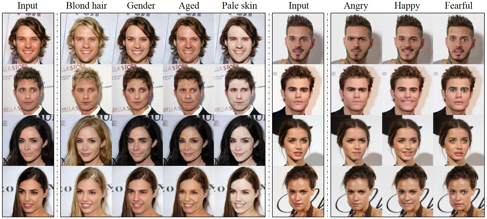

## StarGAN - Official PyTorch Implementation

**\*\*\*\*\* New: StarGAN v2 is available at https://github.com/clovaai/stargan-v2 \*\*\*\*\***

<p align="center"></p>

This repository provides the official PyTorch implementation of the following paper:
> **StarGAN: Unified Generative Adversarial Networks for Multi-Domain Image-to-Image Translation**<br>
> [Yunjey Choi](https://github.com/yunjey)<sup>1,2</sup>, [Minje Choi](https://github.com/mjc92)<sup>1,2</sup>, [Munyoung Kim](https://www.facebook.com/munyoung.kim.1291)<sup>2,3</sup>, [Jung-Woo Ha](https://www.facebook.com/jungwoo.ha.921)<sup>2</sup>, [Sung Kim](https://www.cse.ust.hk/~hunkim/)<sup>2,4</sup>, [Jaegul Choo](https://sites.google.com/site/jaegulchoo/)<sup>1,2</sup>    <br/>
> <sup>1</sup>Korea University, <sup>2</sup>Clova AI Research, NAVER Corp. <br>
> <sup>3</sup>The College of New Jersey, <sup>4</sup>Hong Kong University of Science and Technology <br/>
> https://arxiv.org/abs/1711.09020 <br>
>
> **Abstract:** *Recent studies have shown remarkable success in image-to-image translation for two domains. However, existing approaches have limited scalability and robustness in handling more than two domains, since different models should be built independently for every pair of image domains. To address this limitation, we propose StarGAN, a novel and scalable approach that can perform image-to-image translations for multiple domains using only a single model. Such a unified model architecture of StarGAN allows simultaneous training of multiple datasets with different domains within a single network. This leads to StarGAN's superior quality of translated images compared to existing models as well as the novel capability of flexibly translating an input image to any desired target domain. We empirically demonstrate the effectiveness of our approach on a facial attribute transfer and a facial expression synthesis tasks.*

## Dependencies
* [Python 3.5+](https://www.continuum.io/downloads)
* [PyTorch 0.4.0+](http://pytorch.org/)
* [TensorFlow 1.3+](https://www.tensorflow.org/) (optional for tensorboard)


## Downloading datasets
To download the CelebA dataset:
```bash
git clone https://github.com/yunjey/StarGAN.git
cd StarGAN/
bash download.sh celeba
```

To download the RaFD dataset, you must request access to the dataset from [the Radboud Faces Database website](http://www.socsci.ru.nl:8180/RaFD2/RaFD?p=main). Then, you need to create a folder structure as described [here](https://github.com/yunjey/StarGAN/blob/master/jpg/RaFD.md).

## Training networks
To train StarGAN on CelebA, run the training script below. See [here](https://github.com/yunjey/StarGAN/blob/master/jpg/CelebA.md) for a list of selectable attributes in the CelebA dataset. If you change the `selected_attrs` argument, you should also change the `c_dim` argument accordingly.

```bash
# Train StarGAN using the CelebA dataset
python main.py --mode train --dataset CelebA --image_size 128 --c_dim 5 \
               --sample_dir stargan_celeba/samples --log_dir stargan_celeba/logs \
               --model_save_dir stargan_celeba/models --result_dir stargan_celeba/results \
               --selected_attrs Black_Hair Blond_Hair Brown_Hair Male Young

# Test StarGAN using the CelebA dataset
python main.py --mode test --dataset CelebA --image_size 128 --c_dim 5 \
               --sample_dir stargan_celeba/samples --log_dir stargan_celeba/logs \
               --model_save_dir stargan_celeba/models --result_dir stargan_celeba/results \
               --selected_attrs Black_Hair Blond_Hair Brown_Hair Male Young
```

To train StarGAN on RaFD:

```bash
# Train StarGAN using the RaFD dataset
python main.py --mode train --dataset RaFD --image_size 128 \
               --c_dim 8 --rafd_image_dir data/RaFD/train \
               --sample_dir stargan_rafd/samples --log_dir stargan_rafd/logs \
               --model_save_dir stargan_rafd/models --result_dir stargan_rafd/results

# Test StarGAN using the RaFD dataset
python main.py --mode test --dataset RaFD --image_size 128 \
               --c_dim 8 --rafd_image_dir data/RaFD/test \
               --sample_dir stargan_rafd/samples --log_dir stargan_rafd/logs \
               --model_save_dir stargan_rafd/models --result_dir stargan_rafd/results
```

To train StarGAN on both CelebA and RafD:

```bash
# Train StarGAN using both CelebA and RaFD datasets
python main.py --mode=train --dataset Both --image_size 256 --c_dim 5 --c2_dim 8 \
               --sample_dir stargan_both/samples --log_dir stargan_both/logs \
               --model_save_dir stargan_both/models --result_dir stargan_both/results

# Test StarGAN using both CelebA and RaFD datasets
python main.py --mode test --dataset Both --image_size 256 --c_dim 5 --c2_dim 8 \
               --sample_dir stargan_both/samples --log_dir stargan_both/logs \
               --model_save_dir stargan_both/models --result_dir stargan_both/results
```

To train StarGAN on your own dataset, create a folder structure in the same format as [RaFD](https://github.com/yunjey/StarGAN/blob/master/jpg/RaFD.md) and run the command:

```bash
# Train StarGAN on custom datasets
python main.py --mode train --dataset RaFD --rafd_crop_size CROP_SIZE --image_size IMG_SIZE \
               --c_dim LABEL_DIM --rafd_image_dir TRAIN_IMG_DIR \
               --sample_dir stargan_custom/samples --log_dir stargan_custom/logs \
               --model_save_dir stargan_custom/models --result_dir stargan_custom/results

# Test StarGAN on custom datasets
python main.py --mode test --dataset RaFD --rafd_crop_size CROP_SIZE --image_size IMG_SIZE \
               --c_dim LABEL_DIM --rafd_image_dir TEST_IMG_DIR \
               --sample_dir stargan_custom/samples --log_dir stargan_custom/logs \
               --model_save_dir stargan_custom/models --result_dir stargan_custom/results
```


## Using pre-trained networks
To download a pre-trained model checkpoint, run the script below. The pre-trained model checkpoint will be downloaded and saved into `./stargan_celeba_128/models` directory.

```bash
$ bash download.sh pretrained-celeba-128x128
```

To translate images using the pre-trained model, run the evaluation script below. The translated images will be saved into `./stargan_celeba_128/results` directory.

```bash
$ python main.py --mode test --dataset CelebA --image_size 128 --c_dim 5 \
                 --selected_attrs Black_Hair Blond_Hair Brown_Hair Male Young \
                 --model_save_dir='stargan_celeba_128/models' \
                 --result_dir='stargan_celeba_128/results'
```

## Citation
If you find this work useful for your research, please cite our [paper](https://arxiv.org/abs/1711.09020):
```
@inproceedings{choi2018stargan,
author={Yunjey Choi and Minje Choi and Munyoung Kim and Jung-Woo Ha and Sunghun Kim and Jaegul Choo},
title={StarGAN: Unified Generative Adversarial Networks for Multi-Domain Image-to-Image Translation},
booktitle={Proceedings of the IEEE Conference on Computer Vision and Pattern Recognition},
year={2018}
}
```

## Acknowledgements
This work was mainly done while the first author did a research internship at [Clova AI Research, NAVER](https://clova.ai/en/research/research-area-detail.html?id=0). We thank all the researchers at NAVER, especially Donghyun Kwak, for insightful discussions.
